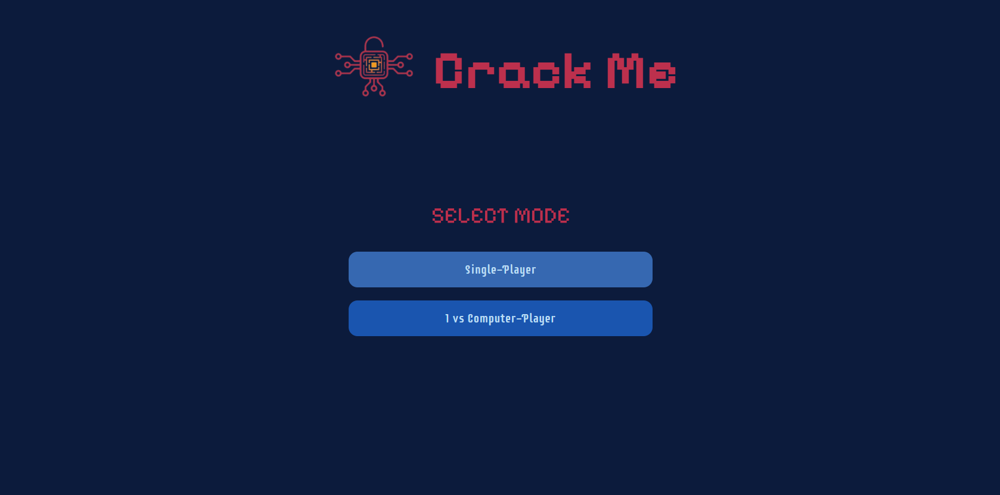
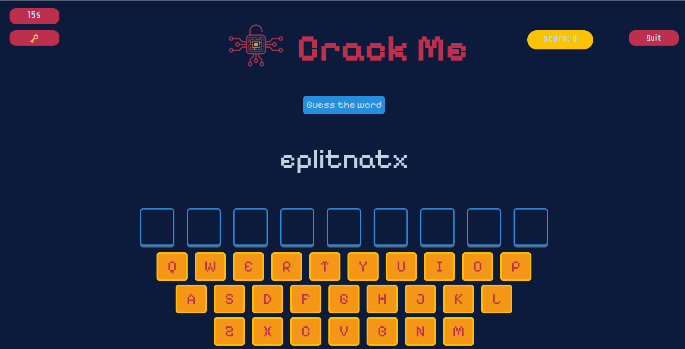
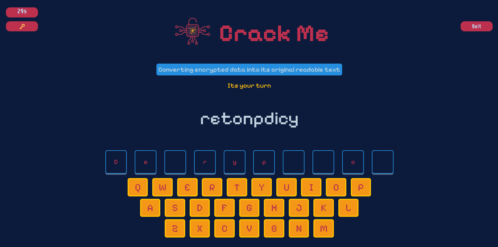
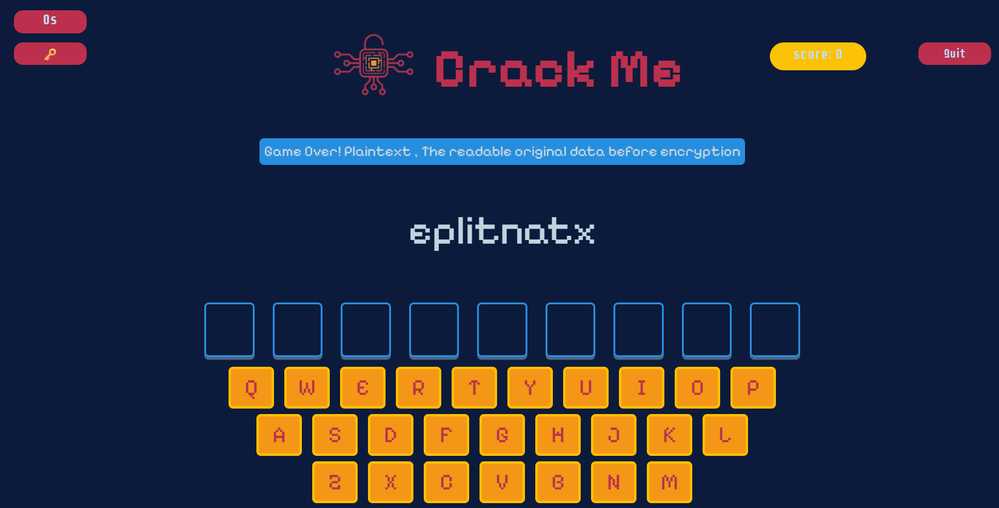
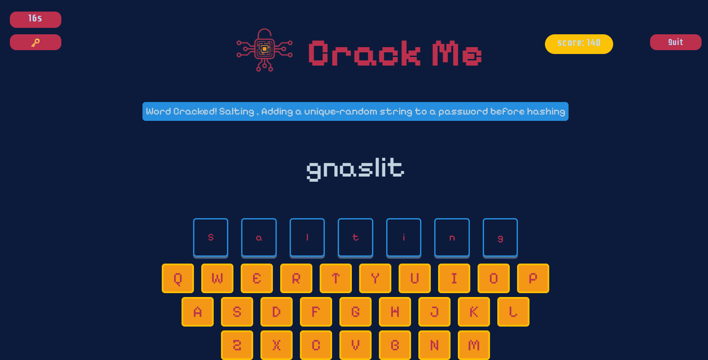

# Project Name
**Crack Me**
## Technologies Used
- Git
- HTML
- CSS
- JavaScript
- DOM Maniplualtion

## Description
Crack Me is a cyber security themed game. The player cracks shuffled security terms, either playing solo or against computer. 

## User Stories
- As a user, I want to be able to chose between single player (solo game) or 1 vs computer player.
- As a user, I want to be able to click on mode buttons, so that I can start the game.
- As a user, I want to be able to have a quit button, so that I can quit the game anytime I want.
- As a user, I want to be able to click on the correct letter one at a time using on screen letter keyboard.
- As a user, I want to be able to have a timer, so that I can lose win timer runs out.
- As a user, I want to be able to have a hint button, so that I can see the difinitionof the word.
- As a user, in a solo game I want to be able to see a message "cracked" if win, the difinition of the word.

- As a user, I want to be able to have shuffled words, so that I can crack them by clicking the correct lettrs.

**Single Player**
- As a user, in a solo game I want to see my score.
- As a user, in a solo game I want to be able to lose when I gueesed 3 letters incorrectly.
- As a user, in a solo game I want to be able to see a message revealing the word if I lose and its difinition.

**vs Computer**
- As a user, in vs Computer game I want the computer to take over when I guees the letter.
- As a user, in vs Computer game I want to be able to see a message displaying whose turn it is, so that I can now if its my turn or not.

## Game Link
[Crack Me](https://wa-2211.github.io/Crack-Me/)

## Screenshots

## Future Enhancements
- As a user, I want to be able to have cipher round, so that I can decrypt the encrypted word.
- As a user, I want to be able to chose diffuclilty level in 1 vs compuetr mode.
- As a user, in vs Computer game I want to be able to be locked and stoped from gueesing after 3 incorrect guesses in a row.
- As a user, in vs Computer mode I want to be able to continue guessing if i guessed corrctly.
- As a user, in vs Computer mode I want to be able to win when I am the first to crack 3 words.
- As a user, in a solo game I want to earn XP, so that I can earn rank title.
- As a user, I want to be able to have a sound effects.

## Credits
- Developed by Walaa Idress